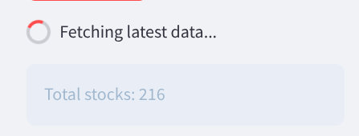

# Stock Sentiment Analysis Dashboard

A comprehensive stock market analysis tool that combines news sentiment, technical indicators, and machine learning predictions for Indian stocks.

## Features

- **Real-Time Stock Data**: Fetches latest stock prices and volume data from Yahoo Finance
- **News Sentiment Analysis**: Analyzes sentiment from recent news using NLP techniques
- **Technical Analysis**: Calculates and visualizes key technical indicators (RSI, MACD, Bollinger Bands)
- **Machine Learning Predictions**: Uses ensemble ML models to predict stock price movements
- **Comprehensive Dashboard**: Interactive UI with multiple views and detailed stock information

## How It Works

### Data Sources
- **Stock Data**: Yahoo Finance API (via yfinance)
- **News Articles**: Google News RSS feeds
- **Stock List**: User-provided CSV file with stock symbols

### Analysis Components
1. **Technical Indicators**: Automated calculation of technical indicators with sentiment analysis
2. **News Sentiment**: NLTK's VADER sentiment analyzer to evaluate news sentiment
3. **ML Predictions**: Ensemble of scikit-learn models (Random Forest, Gradient Boosting, Logistic Regression)

### Dashboard Views
- **Overview**: Quick snapshot of all stocks with combined sentiment scores
- **Detailed Table**: Comprehensive table with all metrics and news links
- **Individual Stock Analysis**: Deep-dive into a single stock with charts and predictions
- **ML Predictions Table**: Consolidated view of predicted price movements

## Deployment on Hugging Face Spaces

### Requirements
- **Python 3.7+**
- **Dependencies**: Listed in requirements.txt
- **RAM**: At least 2GB (recommended 4GB)
- **Storage**: At least 500MB

### Setup Instructions

1. **Create a new Space on Hugging Face**: 
   - Select "Streamlit" as the SDK
   - Choose the appropriate hardware (CPU, RAM)

2. **Configure the Space**:
   - Set environment variables (if needed)
   - Upload the CSV file with stock symbols to the space

3. **Deploy the Application**:
   - Push the code to Hugging Face Spaces Git repository
   - The app will automatically deploy

### Usage Instructions

1. **Upload Stock List**: Place your stock symbol CSV file in the attached_assets folder
2. **Access the Dashboard**: Open the Hugging Face Spaces URL
3. **Navigate the Interface**:
   - Use the sidebar to select stocks or views
   - View real-time analysis and predictions
   - Refresh data as needed

## Technology Stack

- **Frontend**: Streamlit for the web interface
- **Data Processing**: Pandas for data manipulation
- **Visualization**: Plotly for interactive charts
- **Machine Learning**: scikit-learn for prediction models
- **Natural Language Processing**: NLTK for sentiment analysis
- **Data Fetching**: yfinance for stock data, feedparser for news

## Limitations

- Stock data availability depends on Yahoo Finance API
- News sentiment analysis is based on available Google News articles
- Predictions should be used as one factor in investment decisions, not as the sole basis
- The dashboard performs best with a reasonable number of stocks (recommended: 15-30)

## License

This project is licensed under the MIT License - see the LICENSE file for details.

## Acknowledgements

- Yahoo Finance for providing stock data API
- Google News for news articles
- NLTK for sentiment analysis tools
- Streamlit for the wonderful web application framework